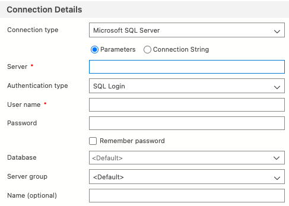

# EF + SQL Server on Mac

## 1. Docker for SQL server 
- download and install docker [here](https://docs.docker.com/desktop/install/mac-install/)

## 2. SQL Sever image
- open docker *(if you can't do so, try restarting your mac, it may help)*
- go to settings `-->` `Resources` `-->` set `Memory` to 4gb if it's less
- open terminal and pull azure-sql-edge image `docker pull  mcr.microsoft.com/azure-sql-edge:latest` *(azure-sql-image offers the same programming interface as sql server)*
- open docker again and go to `Images` tab
- open terminal and run the command `docker run -d --name sql-edge -e "ACCEPT_EULA=Y" -e 'SA_PASSWORD=YOUR-STRONG-PASSWORD' -p 1433:1433 mcr.microsoft.com/azure-sql-edge:latest`

## 3. Azure Data Studio for visualization 
- download and install Azure Data Studio [here](https://docs.microsoft.com/en-us/sql/azure-data-studio/download-azure-data-studio?view=sql-server-ver16#download-azure-data-studio)
- open Data Studio and go to `New` `-->` `New connection `
- fill `Server` with `localhost` ; `User name` with `sa` and `Password` with `your strong password :) `
- click `Connect`

    

## **We are all set 👍**
